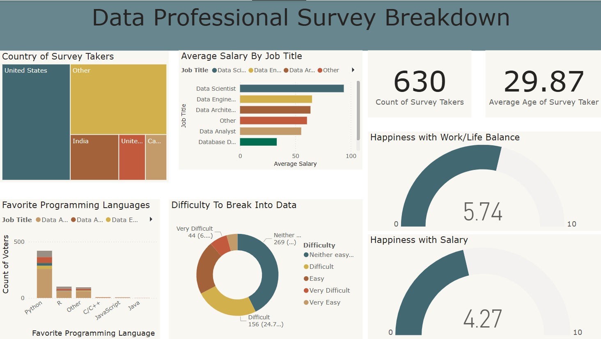

# 📊 Data Professional Survey Dashboard

This Power BI report provides a visual breakdown of insights collected from a survey of data professionals across different regions and roles. It helps explore trends in salaries, career entry difficulty, favorite tools, and job satisfaction levels.

---

## 🗂 Files

- **Power BI Report:** `Data Professional Survey.pbix`
- **Data Source:** `Power BI - Final Project.xlsx`

---

## 📌 Project Objective

The goal of this dashboard is to visualize and analyze:
- Global distribution of survey takers
- Average salary by data-related job titles
- Favorite programming languages among professionals
- Perceived difficulty of entering the data field
- Work-life balance and salary satisfaction ratings

---

## 📈 Dashboard Highlights

### 🌍 Country of Survey Takers
Visualizes the geographic distribution of professionals, with significant responses from India, the US, UK, and Canada.

### 💼 Average Salary by Job Title
Shows salary comparisons between roles such as:
- Data Scientist (highest on average)
- Data Engineer
- Data Architect
- Data Analyst
- Student/Job Seekers

### 🧠 Difficulty to Break Into Data
Pie chart summarizing responses on how hard it was to start a career in data:
- Majority found it “Neither easy nor difficult”
- Some found it “Difficult” or “Very Difficult”

### 💻 Favorite Programming Language
Bar chart showing most preferred languages:
- Python is the most favored
- Followed by R, SQL, Java, and others

### 😊 Work Satisfaction Metrics
Two key gauges reflect:
- **Happiness with Work/Life Balance:** Avg. score ~5.74 / 10
- **Happiness with Salary:** Avg. score ~4.27 / 10

---

## 📊 Dataset Source

The report is based on the Excel dataset `Power BI - Final Project.xlsx`, which contains responses from **630** survey participants with an average age of **29.87** years.

---

## 🚀 How to Use

1. Open `Data Professional Survey.pbix` in [Power BI Desktop](https://powerbi.microsoft.com/desktop/).
2. Review the dashboards and interact with filters for deeper insights.
3. Optionally, connect it to refreshed data or publish to Power BI Service.

---

## 🔧 Requirements

- Power BI Desktop (latest version recommended)

---

## 📝 Notes

- All data is static unless connected to a live refresh.
- Designed for recruiters, educators, analysts, and anyone exploring the data career landscape.

---
